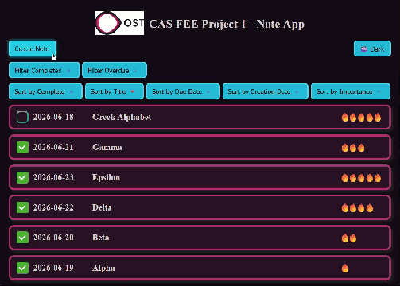
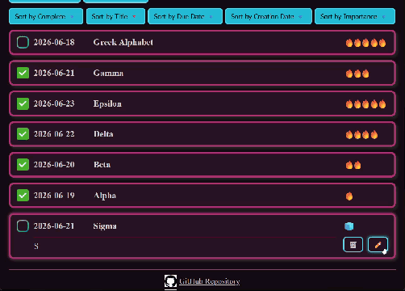
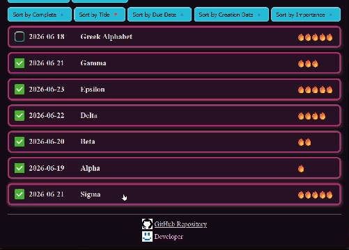
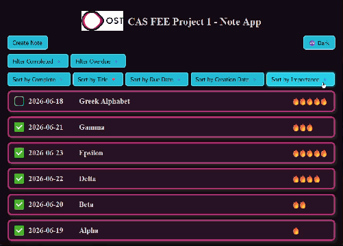
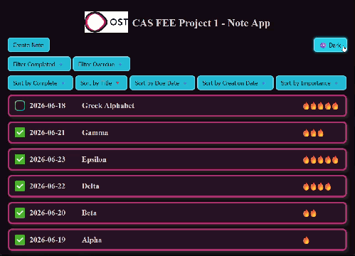

# CAS FEE Project 1 - Note App
## How to Run the App
1. Clone repo
2. Install dependencies `npm install`
3. Run server `npm run start`
4. Connect to server with browser `http://127.0.0.1:3004`

> [!NOTE]
> The html file and all depending files are provided by the server when calling the root address `/`.

## How to Use the App
Most of the functions should be self explaining, so this explanation goes only over the more non logic stuff.  

### Create Note
Click on the 'Create Note' button in the top left corner to show the form to create a new note. 
You will be scrolled automatically to the form so you can't miss it.
Type your data in the input fields (required: title, date) and save the note by clicking on the save button (right one) in the bottom right corner of the component.
If you want to abort the process, you can do so by clicking on the button with the red cross next to the save button.

### See Full Note
To see the full note and therefore be able to see the content of the note and delete and edit it, just click on the title, date or importance text.

### Edit Note
Expand a note and click on the right button of the two buttons (the one with the pen on it) in the bottom right corner of the note. 
You will be automatically scrolled to the note edit form at the beginning of the list.
When you're satisfied with the changes you can save your progress by clicking on the save button in the bottom right corner of the component.
If you don't like the changes and want to discard them, then press the button with the red cross on it next to the save button.

### Delete Note
Expand a note and click on the left button of the two buttons (the one with the bin on it) in the bottom right corner of the note.  

> [!WARNING]
> A delete is permanent and can not be undone.

### Filters and Sortings
Clicking on a filter/sorting button toggles the state of the corresponding property.  
We can have **multiple** filters active at the same time but only **one** sorting.

### Theme
Click the dark/light mode button in the top right corner to switch the theme.

## How to Develop
### Server
All server relevant code is in the [code](./code/) folder.  
Use `npm run start` to start the server.

### Client
All client relevant code is in the [code/public](./code/public/) folder.  
Use `Live Server` to test just the client without the server.

> [!TIP]
> There are several classes with the suffix `online`. These classes are depentant on a server. Use the non online versions to run the client independant from the server. You can do so by inject the non online classes in the `index.js` file where all instances of all services are created and connected.

### Tests
All tests for the server are in [code/tests/server](./code/tests/server/).  
All tests for the client are in [code/tests/client](./code/tests/client/).  
Run tests with `npm run test` or `npm run test:coverage` the latter will also generate a coverage report to see how much of the code is tested.

### Actions
[workflows](./.github/workflows/)

#### Run Tests on PR
[workflow](./.github/workflows/ci-cd.setup-test.yml)  
This workflow make sure all tests run on an independent (non developer) machine before merging new code. It triggers when a PullRequest (PR) is opened or edited.

### Dependabot
[dependabot](./.github/dependabot.yml)  
All GitHub Actions and npm packages are weekly checked for updates. Dependabot will automatically open a PullRequest when a update is available.
